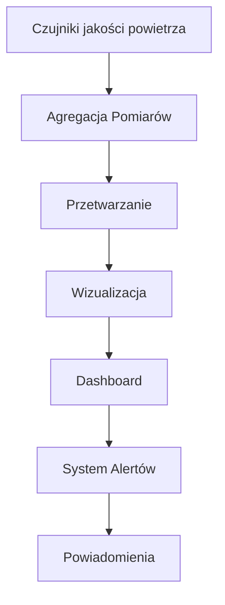
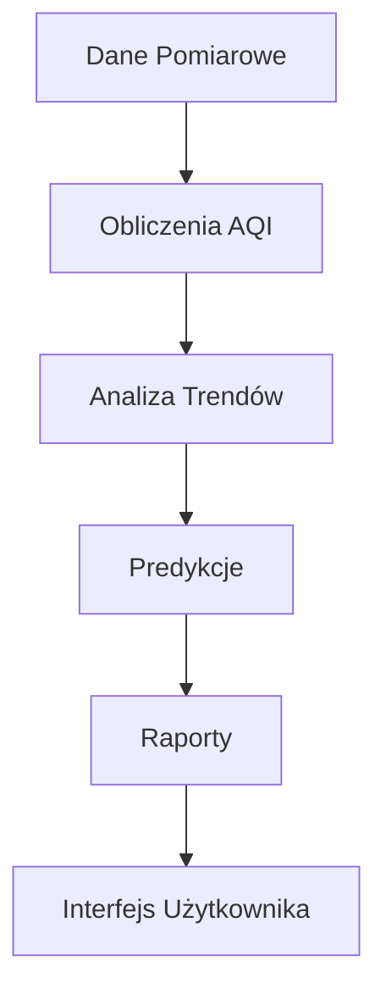
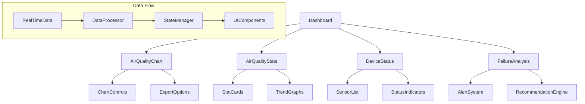

# System Architecture Documentation - Air Quality Monitoring Dashboard

## 1. Przegląd Systemu
System implementuje zaawansowany dashboard do monitorowania jakości powietrza i zarządzania siecią czujników pomiarowych w czasie rzeczywistym. Główne funkcjonalności obejmują:
- Monitorowanie jakości powietrza w czasie rzeczywistym
- Analiza trendów zanieczyszczeń
- Status czujników pomiarowych
- System alertów i powiadomień o przekroczeniach norm
- Integracja z sieciami pomiarowymi (Airly, GIOŚ)

## 2. Główne Komponenty

### Monitoring Powietrza (`src/components/dashboard/AirQualityChart.tsx`)
- Interaktywne wykresy zanieczyszczeń
- Możliwość przełączania między różnymi parametrami (PM2.5, PM10, NO2, etc.)
- System eksportu danych (PDF/JPG)
- Funkcje przybliżania i analizy szczegółowej
- **Punkty dostosowania:**
  ```typescript
  // Kolory wykresu dla różnych poziomów zanieczyszczeń
  <Line stroke="#34D399" /> // Dobre
  <Line stroke="#FBBF24" /> // Umiarkowane
  <Line stroke="#F59E0B" /> // Dostateczne
  <Line stroke="#EF4444" /> // Złe
  
  // Konfiguracja legendy
  <Legend 
    verticalAlign="bottom"
    height={36}
  />
  
  // Dostosowanie tooltipów
  <CustomTooltip />
  ```

### Statystyki Jakości Powietrza (`src/components/dashboard/AirQualityStats.tsx`)
- Karty z kluczowymi wskaźnikami
- Animowane wskaźniki jakości
- Wykresy trendów
- **Punkty dostosowania:**
  ```typescript
  // Progi jakości powietrza
  const getAirQualityColor = (pm25: number) => {
    if (pm25 <= 10) return "bg-green-500";
    if (pm25 <= 25) return "bg-yellow-500";
    if (pm25 <= 50) return "bg-orange-500";
    return "bg-red-500";
  };
  ```

### Status Czujników (`src/components/network/DeviceStatus.tsx`)
- Monitoring stacji pomiarowych
- Status czujników
- Parametry kalibracji
- **Punkty dostosowania:**
  ```typescript
  // Konfiguracja statusów
  const sensorStatuses = {
    online: "bg-green-500",
    warning: "bg-yellow-500",
    error: "bg-red-500"
  };
  ```

### Analiza Przekroczeń (`src/components/network/FailureAnalysis.tsx`)
- System wykrywania przekroczeń norm
- Rekomendacje działań prewencyjnych
- Historia alertów
- **Punkty dostosowania:**
  ```typescript
  // Priorytety alertów
  const priorityLevels = {
    high: { color: "red", icon: AlertTriangle },
    medium: { color: "yellow", icon: AlertCircle },
    low: { color: "blue", icon: Info }
  };
  ```

## 3. Przepływ Danych

### Monitoring w czasie rzeczywistym


### Analiza Jakości Powietrza


## 4. Kluczowe Technologie
- **Frontend**: React + TypeScript
  - Komponenty funkcyjne
  - Hooks dla logiki biznesowej
  - TypeScript dla bezpieczeństwa typów
- **Wizualizacja**: Recharts
  - Responsywne wykresy
  - Interaktywne elementy
  - Customizacja stylów
- **UI Framework**: Tailwind CSS + shadcn/ui
  - System projektowania
  - Komponenty wielokrotnego użytku
  - Responsywny układ
- **Animacje**: Framer Motion
  - Płynne przejścia
  - Interaktywne elementy
  - Animacje wykresów
- **Eksport Danych**: 
  - HTML2Canvas dla zrzutów ekranu
  - jsPDF dla dokumentów PDF

## 5. Architektura Danych

### Struktura Danych Pomiarowych
```typescript
interface AirQualityData {
  id: string;
  type: 'pm25' | 'pm10' | 'no2' | 'so2' | 'o3' | 'co';
  value: number;
  unit: string;
  timestamp: Date;
  status: 'good' | 'moderate' | 'poor' | 'hazardous';
}
```

### Format Alertów
```typescript
interface Alert {
  id: string;
  severity: 'low' | 'medium' | 'high';
  message: string;
  timestamp: Date;
  acknowledged: boolean;
  sensorId: string;
  pollutant: string;
  threshold: number;
}
```

### Dane Historyczne
```typescript
interface HistoricalData {
  period: 'hour' | 'day' | 'week' | 'month';
  data: Array<{
    timestamp: Date;
    parameters: {
      pm25?: number;
      pm10?: number;
      no2?: number;
      so2?: number;
      o3?: number;
      co?: number;
    }
  }>;
}
```

## 6. Planowane Ulepszenia
1. **Zaawansowana Analityka**
   - Machine Learning dla predykcji jakości powietrza
   - Automatyczna detekcja anomalii w pomiarach
   - Korelacja z danymi meteorologicznymi

2. **Rozszerzone Możliwości Eksportu**
   - Nowe formaty raportów
   - Customizowane szablony
   - Automatyczne harmonogramy raportowania

3. **Ulepszona Wizualizacja**
   - Mapy cieplne zanieczyszczeń
   - Interaktywne dashboardy
   - Wizualizacje 3D rozkładu zanieczyszczeń

4. **Integracje**
   - API dla systemów zewnętrznych
   - Integracja z dodatkowymi sieciami pomiarowymi
   - Wsparcie dla różnych protokołów komunikacji

5. **Optymalizacja Wydajności**
   - Buforowanie danych pomiarowych
   - Optymalizacja zapytań
   - Progresywne ładowanie danych historycznych

## 7. Struktura Komponentów


## 8. Kluczowe Miejsca do Dostosowania

### Konfiguracja Czujników (`src/data/sensors/`)
```typescript
// Przykład konfiguracji czujnika
export const sensorConfig = {
  id: "1",
  location: "Gdańsk Główny",
  parameters: ["pm25", "pm10", "no2"],
  thresholds: {
    pm25: { warning: 25, alert: 50 },
    pm10: { warning: 50, alert: 100 },
    no2: { warning: 100, alert: 200 }
  }
};
```

### Komponenty UI (`src/components/ui/`)
```typescript
// Przykład customizacji komponentu
export const AirQualityCard = styled(Card)`
  border-radius: 12px;
  box-shadow: 0 4px 6px rgba(0, 0, 0, 0.1);
`;
```

### Tłumaczenia (`src/i18n/translations/`)
```typescript
// Przykład dodania nowych tłumaczeń
export const translations = {
  pl: {
    airQuality: {
      title: "Panel monitorowania jakości powietrza",
      stats: "Statystyki",
      alerts: "Alerty",
      parameters: {
        pm25: "PM2.5",
        pm10: "PM10",
        no2: "NO₂"
      }
    }
  }
};
```

### Konfiguracja Wykresów (`src/components/dashboard/`)
```typescript
// Przykład konfiguracji wykresu jakości powietrza
const chartConfig = {
  colors: {
    good: "#34d399",
    moderate: "#fbbf24",
    poor: "#f59e0b",
    hazardous: "#ef4444"
  },
  animations: true,
  tooltip: {
    enabled: true,
    format: "wartość: {value} {unit}"
  }
};
```

### System Alertów (`src/components/network/`)
```typescript
// Przykład konfiguracji alertów jakości powietrza
const alertConfig = {
  thresholds: {
    pm25: { warning: 25, critical: 50 },
    pm10: { warning: 50, critical: 100 },
    no2: { warning: 100, critical: 200 },
    so2: { warning: 125, critical: 350 }
  },
  notifications: {
    email: true,
    push: true,
    sms: false
  }
};
```
